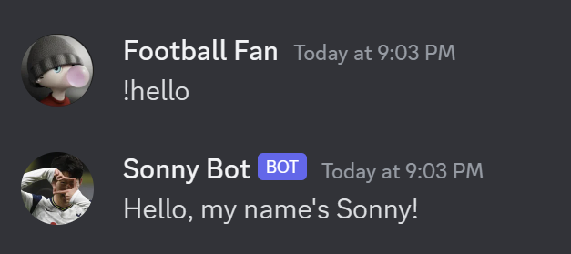

# Sonny-Bot
Sonny Bot is a Discord bot companion for football enthusiasts! The bot scrapes transfermarkt.us to produce comprehensive player and club data from 30+ official leagues worldwide, providing football fans a one-stop solution for all their football information needs.

### Starting the Bot
A Discord user can check if the bot has started running, simply by typing the !hello command.

### Search Player Information and Stats
By using the command `!player [player_name]`, such as `!player Erling Haaland`, the user can see information such as:
* Player's Current Club
* Player's Preferred Position
* Player's Current Performance (ex. Goals, Assists, etc. per Tournament... Details are different for GKs vs. Outfields)
* Player's Starting Eleven Probability (SE)
* Player's Availability (ex. Injuries, Suspensions)
* Transfer Rumors around the Player
* ... and more!
  

  
  
  

Sonny Bot can also show information for players who are currently without a contract: 

### Search Club Information and Stats
By using the command `!club [club_name]`, such as `!club Manchester City`, the user can see information such as:
* Club's Current League and Position
* Club's Future Opponents and Matchtime
* Club's Domestic League Form (As per their last 5 matches)

### Error Handling
The Discord Bot provides descriptive error handling features/messages to ensure users utilize the Bot correctly. This includes:

Error message when the user has provided an invalid player/club name:

Option for user to specify the correct player/club, when given multiple results:

Error message when user has initiated an action but failed to provide a response:

Error message when user has provided an invalid/incorrect response:

